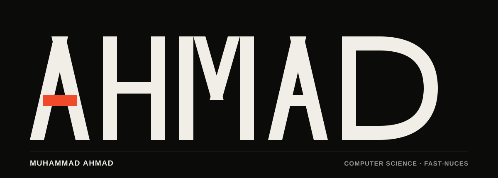
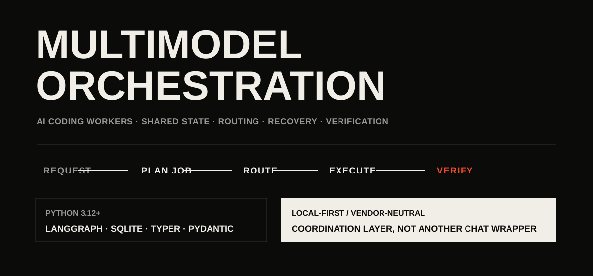
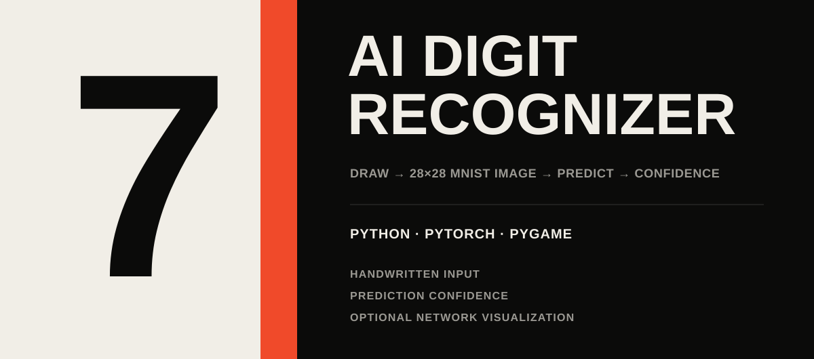
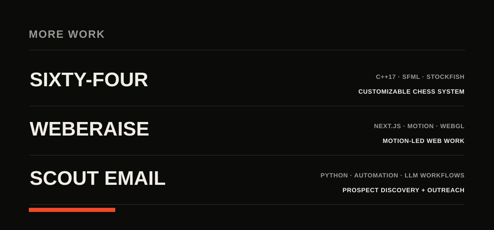
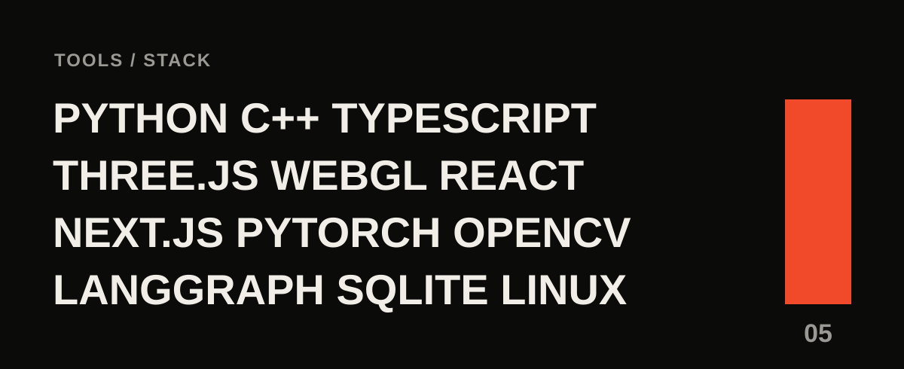

  

  <strong>Muhammad Ahmad</strong> 
  Computer Science @ FAST-NUCES  
  <a href="https://ahmad-portfolio.manbtd1.workers.dev/">Portfolio</a>
  &nbsp;&nbsp;·&nbsp;&nbsp;
  <a href="https://www.linkedin.com/in/muhammad-ahmad-3a8564383/">LinkedIn</a>
  &nbsp;&nbsp;·&nbsp;&nbsp;
  <a href="mailto:manbtd1@gmail.com">Email</a>

 

 

 

 

  <a href="https://github.com/ahmad-obj/Chess">Sixty-Four</a>
  &nbsp;&nbsp;·&nbsp;&nbsp;
  <a href="https://github.com/ahmad-obj/Weberaise">WEBERAISE</a>
  &nbsp;&nbsp;·&nbsp;&nbsp;
  <a href="https://github.com/ahmad-obj/scout-email">Scout Email</a>

 

 

  <a href="https://ahmad-portfolio.manbtd1.workers.dev/">Portfolio</a>
  &nbsp;&nbsp;·&nbsp;&nbsp;
  <a href="https://www.linkedin.com/in/muhammad-ahmad-3a8564383/">LinkedIn</a>
  &nbsp;&nbsp;·&nbsp;&nbsp;
  <a href="mailto:manbtd1@gmail.com">Email</a>
  &nbsp;&nbsp;·&nbsp;&nbsp;
  <a href="https://github.com/ahmad-obj">GitHub</a>

