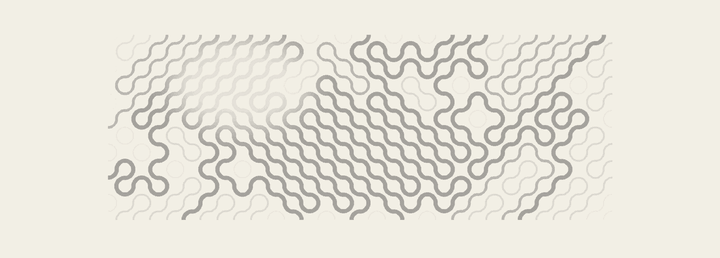

  

  <strong>Computer Science @ FAST-NUCES</strong> 
  I like systems where simple rules compound into complex behavior — across software, AI, graphics, and automation.

  <a href="https://ahmad-portfolio.manbtd1.workers.dev/">Portfolio</a>
  &nbsp;&nbsp;·&nbsp;&nbsp;
  <a href="https://www.linkedin.com/in/muhammad-ahmad-3a8564383/">LinkedIn</a>
  &nbsp;&nbsp;·&nbsp;&nbsp;
  <a href="mailto:manbtd1@gmail.com">Email</a>

 

## Selected systems

<table>
  <tr>
    <td width="50%" valign="top">
      01 / INTERACTIVE GRAPHICS  
      <strong><a href="https://github.com/ahmad-obj/3dcarweb">3D Automotive Experience ↗</a></strong> 
      A cinematic WebGL automotive experience built around real-time 3D, motion, lighting, materials, and camera choreography.  
      <code>Next.js</code> <code>Three.js</code> <code>R3F</code>
    </td>
    <td width="50%" valign="top">
      02 / AGENT SYSTEMS  
      <strong><a href="https://github.com/ahmad-obj/multimodel-orchestration">Multimodel Orchestration ↗</a></strong> 
      Coordinating AI coding workers through shared state, task routing, persistence, and verification.  
      <code>Python</code> <code>LangGraph</code> <code>SQLite</code>
    </td>
  </tr>
  <tr>
    <td width="50%" valign="top">
      03 / APPLIED AI  
      <strong><a href="https://github.com/ahmad-obj/AI-digit-recognizer">AI Digit Recognizer ↗</a></strong> 
      Interactive handwritten-digit recognition with confidence scores and network visualization.  
      <code>Python</code> <code>PyTorch</code> <code>Pygame</code>
    </td>
    <td width="50%" valign="top">
      04 / SOFTWARE SYSTEMS  
      <strong><a href="https://github.com/ahmad-obj/Chess">Sixty-Four ↗</a></strong> 
      A customizable chess system with Stockfish, variants, clocks, persistence, and a Windows build.  
      <code>C++17</code> <code>SFML</code> <code>Stockfish</code>
    </td>
  </tr>
</table>

## In the lab

**[WEBERAISE ↗](https://github.com/ahmad-obj/Weberaise)** — motion-led web work, custom interaction, and WebGL experiments.  
**[Scout Email ↗](https://github.com/ahmad-obj/scout-email)** — structured prospect discovery and personalized outreach automation.

## Working surface

`Python` · `C++` · `TypeScript` · `React` · `Next.js` · `Three.js` · `PyTorch` · `OpenCV` · `LangGraph` · `SQLite` · `Docker`

 

build → break → understand → rebuild

