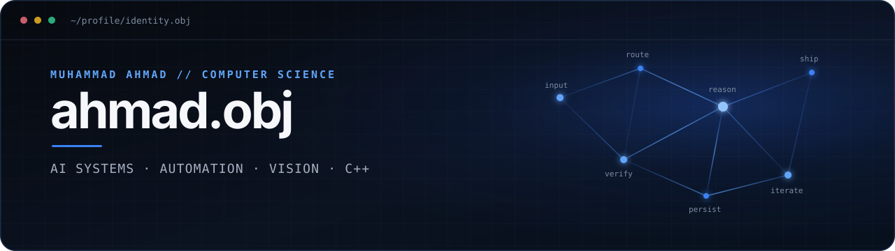

<p align="center">
  
</p>

<p align="center">
  <samp>Computer Science @ FAST-NUCES · Python + C++ · AI Systems · Computer Vision</samp>
</p>

I’m **Muhammad Ahmad**, a Computer Science student who builds practical software around AI workflows, automation, computer vision, and systems that begin as over-ambitious experiments.

I care about the part after the idea: architecture, edge cases, iteration, and getting the thing to actually work.

```text
ahmad@github:~$ current_focus
> coordinating AI coding workers with shared state
> automating research and operational workflows
> building computer-vision applications
> going deeper with C++ and software design
```

## Selected work

| Project | What it is | Built around |
| :-- | :-- | :-- |
| **[Multimodel Orchestration](https://github.com/ahmad-obj/multimodel-orchestration)** | Local-first orchestration for coordinating AI coding workers with shared state, routing, persistence, and verification. | Python · LangGraph · SQLite |
| **[Scout Email](https://github.com/ahmad-obj/scout-email)** | A structured pipeline for prospect discovery and personalized outreach automation. | Python · Browser automation · LLM workflows |
| **[AI Digit Recognizer](https://github.com/ahmad-obj/AI-digit-recognizer)** | An interactive handwritten-digit recognizer with prediction confidence and neural-network visualization. | Python · PyTorch · Pygame |
| **[Sixty-Four](https://github.com/ahmad-obj/Chess)** | A customizable chess game with Stockfish, multiple variants, clocks, save/load, and a playable Windows build. | C++17 · SFML · Stockfish |
| **[WEBERAISE](https://github.com/ahmad-obj/Weberaise)** | A motion-led agency website with custom WebGL experiences and carefully designed responsive interactions. | Next.js · TypeScript · GSAP · WebGL |

## Toolkit

| Core | AI / Vision | Systems / Automation | Web / Delivery |
| :-- | :-- | :-- | :-- |
| Python, C++ | PyTorch, OpenCV, LLM APIs | LangGraph, n8n, SQLite, Docker | React, Next.js, WordPress, Git |

## How I build

- Start with the real problem, not the fashionable tool.
- Prefer working systems over impressive-looking demos.
- Use AI as engineering leverage—not as a substitute for understanding.
- Keep rebuilding until the result feels intentional.

<p align="center">
  <a href="mailto:manbtd1@gmail.com">Email</a>
  &nbsp;·&nbsp;
  <a href="https://github.com/ahmad-obj?tab=repositories">Repositories</a>
</p>

<p align="center"><samp>build → break → understand → rebuild</samp></p>
